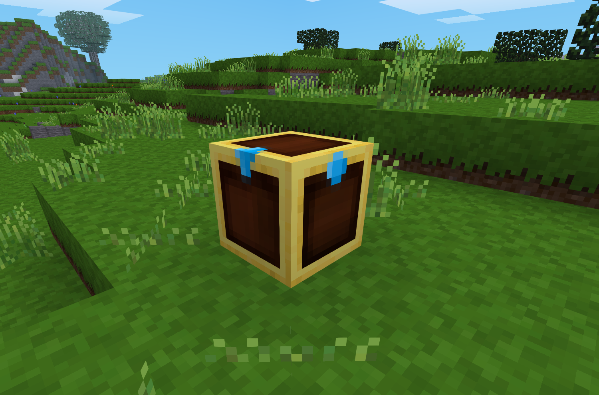
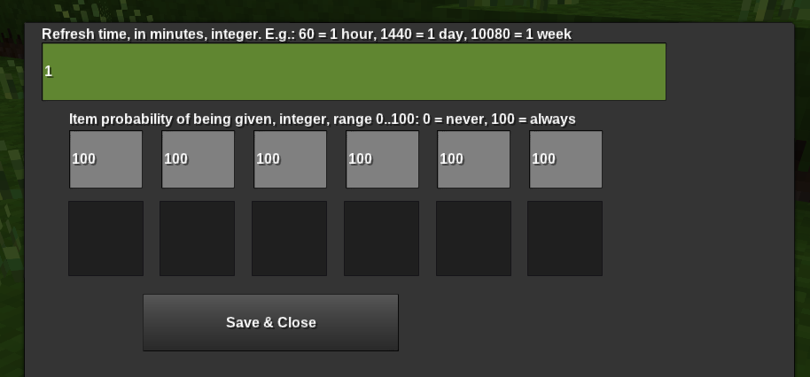

# Treasure Chest mod for Minetest

 

## What is it?
Treasure Chest is a small mod for the Minetest game that adds a kind of chest made for world designers.
The chest has no crafting recipe, so it has to be obtained by /giveme or other commands.

The intended use and original idea, comes from trying to design challenges in a survival world,
and having some way to automatically reward players who complete the challenges.

The rewards can be somewhat randomized, with a probability for each one, and can reset after
a specified time, on a per user basis, after being given out.

When the chest is used by someone without the `give` privilege, the chest will attempt to give
a copy of the items inside it (with some chance) to the user. The chest then records the last time
this user has tried to get the items, and the user will then have to wait for a timeout period to
expire before he/she can have a chance of obtaining the items again. This timeout period is per-user.

For someone with the `give` privilege, the chest will display a GUI that allows you to configure it.

- 1st input: Refresh Time: An integer value
  - The number of minutes of gametime that must pass before the chest can give its items out again.
  - This is on a per-user basis, so two users can always obtain the reward if they use the chest, but if the same user tries to use it before the refresh timeout, he will get nothing.

- 2nd line: Six input: Integer values
  - Probabilities, ranging 0..100, of how likely a reward is to be given to a user. Randomly determined each time the chest is used. Associated with the inventory slot below each one

- 3rd line: Six inventory slots
  - The items to be given out, as associated by the probabilities above them. Each slot can hold a regular item stack. Items stacks are given out as a whole, so the user will get either the whole item stack, or nothing from that slot. Item stacks in these slots are not taken by regular users using the chest, instead they get copied.

## License Info:

See [license.txt](license.txt).

## Dependencies
Minetest engine and Minetest game (see https://www.minetest.net)

## Bugs/contact info
Submit bugs on github: https://github.com/ZenonSeth/treasure_chest
