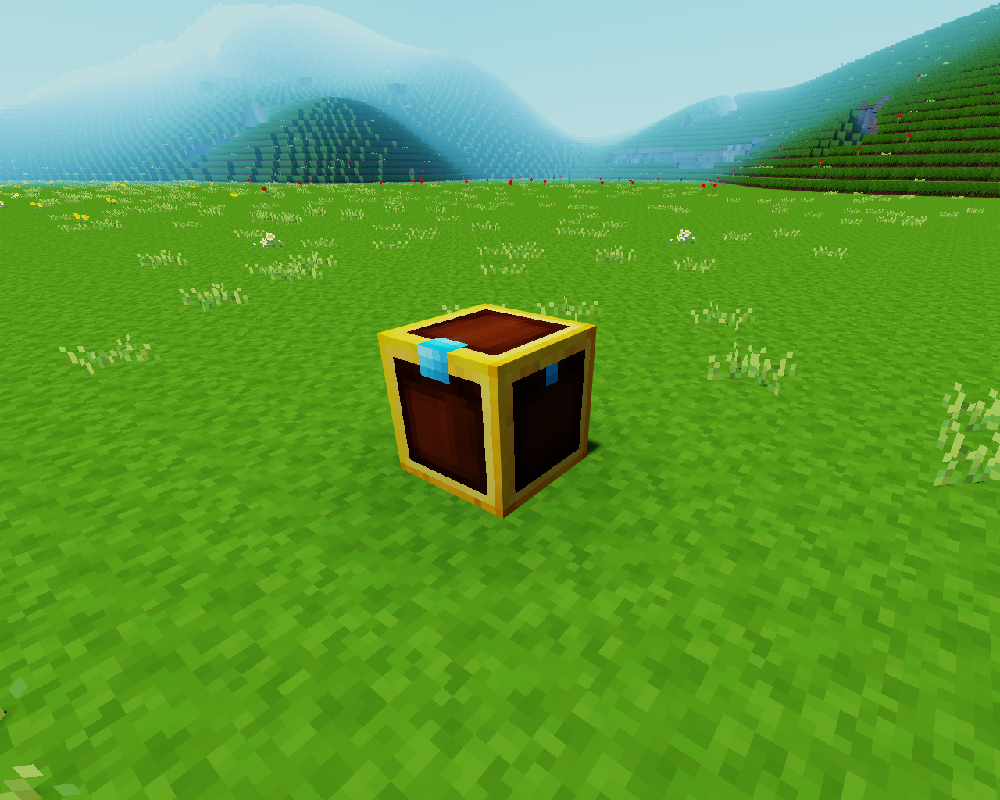
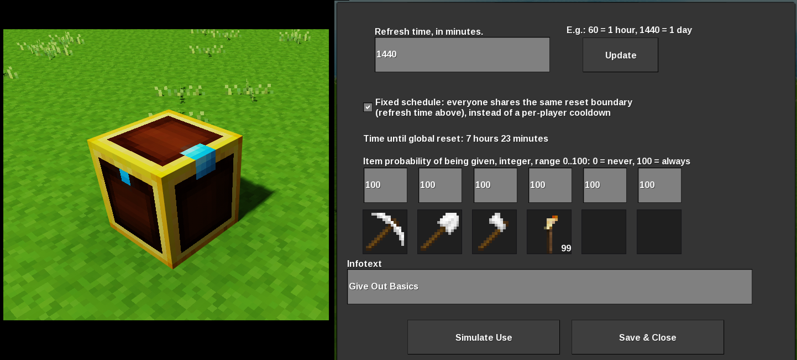

# Treasure Chest mod for Minetest

 

## What is it?
Treasure Chest is a small mod for the Minetest game that adds a kind of chest made for world designers.
The chest has no crafting recipe, so it has to be obtained by /giveme or other commands.

The idea is to help design challenges in a survival world, and give a way to automatically
reward players who complete them.

The rewards are randomized, with a chance for each item, and can reset after some time.

## How it works for players
When a player without admin access uses the chest, it tries to give a copy of each item inside
it, based on the chance set for that item. The chest then remembers when this player last tried,
and the player must wait before trying again. The player gets a chat message showing what they
got and when they can try again.

## How it works for admins
A player who owns the chest, or has the treasurechest_admin privilege, sees a setup screen
instead when using the chest.

- Refresh time: minutes that must pass before a player can get rewards again.
  - 0 means always give.
  - -1 means the chest can only ever be used once per player.
- Fixed schedule: when checked, all players share the same reset times, lined up with real
  world midnight, instead of each player having their own timer. A label shows the time left
  until the next shared reset.
- Item chances: six numbers from 0 to 100, one for each item slot. 0 means never given, 100
  means always given.
- Item slots: six inventory slots holding the items to give out. Items are copied, not taken
  from the chest.
- Infotext: text shown when a player looks at the chest.
- Update: saves the refresh time and fixed schedule setting without closing the screen.
- Simulate Use: saves everything and rolls the chances once, showing what a player would have
  gotten, without using up anyone's cooldown.
- Save & Close: saves everything and closes the screen.

## Privileges
- treasurechest_admin: lets a player set up and dig up chests they do not own.
- The chest owner can always set up and dig up their own chest.

## License Info

See [license.txt](license.txt).

## Dependencies
Minetest engine and Minetest game, see https://www.minetest.net

## Bugs and contact info
Submit bugs on github: https://github.com/ZenonSeth/treasure_chest
